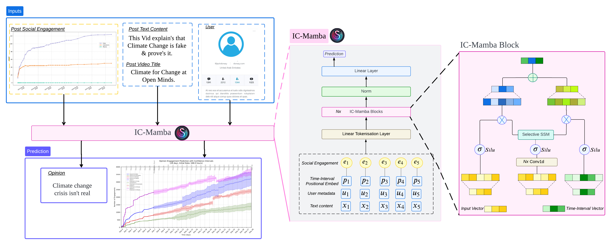
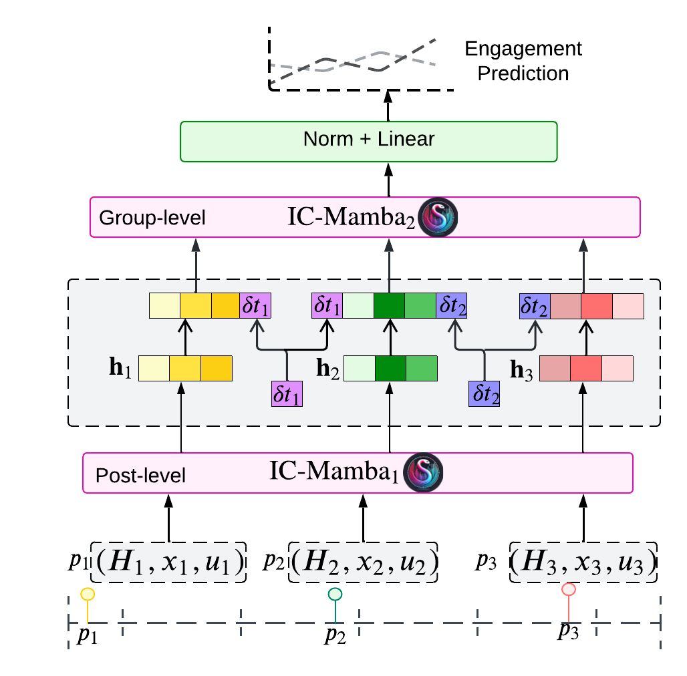
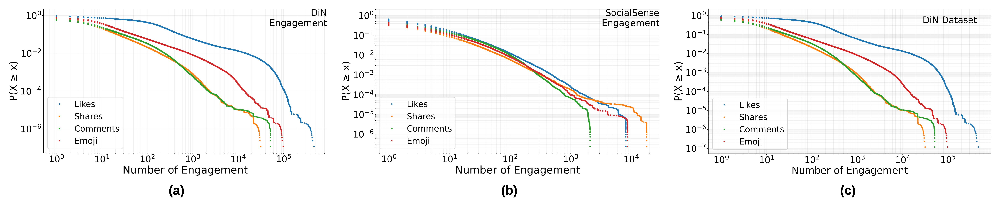
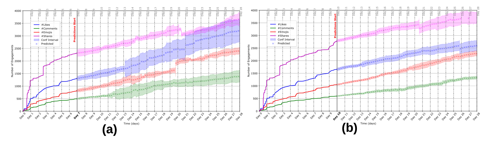

##  Introduction: From 4chan to Capitol - When Online Conspiracies Turn Deadly

On October 28, 2017, an anonymous 4chan user made a cryptic post claiming Hillary Clinton would be arrested within days. Four years later, on January 6, 2021, devotees of the QAnon conspiracy theory - which originated from that very post - stormed the U.S. Capitol in an act that left five people dead and over 140 police officers injured.

This tragic event underscores a critical question: 

**What if we could have seen this coming?**

Today, we're introducing IC-Mamba, a state-of-the-art model that can forecast social media engagement patterns and detect viral misinformation before it spirals out of control. By modeling the complex temporal dynamics of how content spreads online, IC-Mamba achieves unprecedented accuracy in predicting which posts will go viral - often within just 15-30 minutes of publication.

**Paper citation:**
```
Tian, L., Booth, E., Bailo, F., Droogan, J. and Rizoiu, M.A., 2025, April. 
Before It's Too Late: A State Space Model for the Early Prediction of Misinformation and Disinformation Engagement. 
In Proceedings of the ACM on Web Conference 2025 (pp. 5244-5254).
```
(_see full paper here: [https://dl.acm.org/doi/abs/10.1145/3696410.3714527](https://dl.acm.org/doi/abs/10.1145/3696410.3714527)_)

## The Challenge: Understanding Interval-Censored Social Media Data

Social media platforms don't provide continuous streams of engagement data. Instead, they offer snapshots at irregular intervals - what we call "interval-censored" data. As illustrated in Figure 1, while users interact with content continuously, platforms only report cumulative counts at discrete observation points.


<p style="text-align: center;"><em>Figure 1. Illustration of interval-censored social media engagement data. </em></p>

This creates unique challenges:
- **Irregular sampling**: Observation intervals vary from minutes to hours
- **Cumulative counts**: We only see totals, not individual actions
- **Multi-scale dynamics**: Engagement patterns evolve from rapid initial spread to long-term influence


## IC-Mamba: A Novel Architecture for Early Detection

IC-Mamba combines three key components to tackle these challenges:

#### 1. Time-Aware Positional Embeddings

We developed a dual encoding strategy that captures both relative and absolute temporal relationships:

**Relative Temporal Encoding (RTE)**:

``RTE(t, t_ref) = sin((t - t_ref) / σ)``

**Absolute Temporal Encoding (ATE)**:

``ATE(t) = [sin(t/10000^(2i/d)), cos(t/10000^(2i/d))]``


These embeddings are then modulated by observed engagement levels, allowing the model to learn characteristic temporal patterns associated with different levels of social impact.

#### 2. Interval-Censored State Space Modeling

We extend the Mamba architecture to handle varying-length censored intervals through:

- **Interval-aware vectors** that encode time gaps and engagement counts
- **Time-dependent state transitions** using matrix exponentials
- **Selective state processing** through parallel pathways



<p style="text-align: center;"><em>Figure 2. Overview of the IC-Mamba Architecture. </em></p>

#### 3. Two-Tier Architecture

As shown in Figure 3, IC-Mamba uses a hierarchical approach:
- **Tier 1**: Models individual post engagement dynamics
- **Tier 2**: Captures temporal interactions between posts sharing the same opinion



<p style="text-align: center;"><em>Figure 3. Overview of the Two-Tier IC-Mamba Architecture. </em></p>


## How IC-Mamba Works

#### Post-Level Engagement Prediction

IC-Mamba's post-level prediction capabilities stem from its sophisticated handling of temporal dynamics and multi-modal information integration:

**1. Unified Sequence Representation**  
The model creates a comprehensive embedding for each post by combining:

``SE(p) = Encoder([CLS] ⊕ [text] ⊕ [SEP] ⊕ [user] ⊕ [SEP] ⊕ [timeline] ⊕ [SEP] ⊕ [engagement])``


This allows IC-Mamba to jointly learn from textual content, user metadata, and temporal engagement patterns in a single unified framework.

**2. Interval-Aware State Processing**  
For each observation time, the model constructs an interval-aware vector that captures:
- Time since last observation (Δt⁻)
- Current engagement levels (log(1 + e))
- Forward interval length (Δt⁺)
- Predicted next engagement

This rich representation enables the model to understand not just what happened, but when and how quickly it occurred.

**3. Adaptive State Transitions**  
The state space model adapts to varying observation intervals through:

``A_t(Δt) = exp(Δt · Ã_t)``

This matrix exponential formulation allows smooth interpolation across irregular time gaps, maintaining temporal coherence even with sparse observations.

#### Opinion-Level Classification

IC-Mamba's exceptional performance in identifying misinformation narratives comes from its two-tier architecture and sophisticated temporal modeling:

**1. Learning Opinion Signatures**  
The first tier (IC-Mamba₁) processes individual posts to learn characteristic engagement patterns for different opinion types. Posts expressing similar opinions often exhibit similar temporal dynamics - for instance, conspiracy theories might show rapid initial spread followed by sustained engagement from dedicated communities.

**2. Capturing Narrative Evolution**  
The second tier (IC-Mamba₂) models how opinions spread across multiple posts:

``z_o = IC-Mamba₂((h_i, δt_i))``

Where:
- `h_i`: Hidden representations from individual posts
- `δt_i`: Time intervals between posts expressing the same opinion

This allows the model to identify coordinated campaigns where multiple accounts push similar narratives with strategic timing.

**3. Multi-Scale Temporal Features**  
The model learns to distinguish between:
- **Organic discussions**: Natural ebb and flow of engagement, constrained by human attention limits
- **Coordinated campaigns**: Artificial amplification patterns, strategic timing, and sustained engagement beyond natural thresholds

**4. Context-Aware Classification**  
Unlike text-only approaches (like BERT), IC-Mamba incorporates:
- Engagement velocity (how quickly reactions accumulate)
- User network effects (who's sharing and when)
- Temporal coordination (synchronized posting patterns)
- Cross-platform dynamics (when available)

This multi-faceted approach explains why IC-Mamba achieves F1 scores of 0.69-0.75 on organic content and maintains 0.51 performance even on sophisticated disinformation campaigns where text-only models fail dramatically.

## Understanding Engagement Patterns: Misinformation vs. Disinformation

Figure 4 reveals differences between misinformation discussions and coordinated campaigns:



<p style="text-align: center;"><em>Figure 4: Engagement distribution patterns. </em></p>
<!--  -->

**Misinformation content (Climate Change)**:
- Follows human-scale constraints (~150 stable connections - Dunbar's number)
- Plateaus around 10³ engagements
- Uniform decay across engagement types

**Coordinated campaigns (DiN)**:
- Transcends natural limits, reaching 10⁶ engagements
- Marked stratification, especially in likes
- Self-similar temporal behavior across all observation windows


## Real-World Impact: Tracking "Climate Change is a UN Hoax"



<p style="text-align: center;"><em>Figure 5: Early prediction performance on "Climate Change is a UN Hoax". </em></p>

<!--  -->

Figure 5a and 5b showcase IC-Mamba's ability to forecast opinion-level engagement over 28 days:

- **7-day observation window**: Predictions remain accurate with wider confidence intervals
- **10-day observation window**: Tighter confidence bands and improved long-term accuracy
- **Multi-engagement tracking**: Simultaneously forecasts likes, comments, shares, and emoji reactions


## Technical Deep Dive: The Mathematics Behind IC-Mamba

#### State Space Formulation

The model uses time-dependent state transitions:

A_t(Δt) = exp(Δt · Ã_t) ∈ ℝ^(D_h × D_h)
h_t = A_t(Δt)h_{t-1} + B_t x_t
y_t = C_t^T h_t

Where:
- `h_t`: Hidden state at time t
- `Δt`: Interval between observations
- `exp(Δt · Ã_t)`: Matrix exponential for smooth interpolation

#### Loss Functions

We combine two objectives for robust training:

**Engagement Prediction Loss**:

`L_pred = (1/|P|) Σ_p Σ_j ||ê_{j+1} - e_{j+1}||²`


**Temporal Coherence Loss**:


`L_temp = (1/|P|) Σ_p Σ_j ||h_{j+1} - exp(Δt_j^+ · Ã_t)h_j||²`


## Conclusion: A Tool for Digital Defense

IC-Mamba shows our ability to detect and predict the spread of misinformation and disinformation online. By providing early warnings -- often within 15-30 minutes of posting -- it offers platforms and researchers crucial time to:

- Identify potentially harmful content before mass exposure
- Track coordinated information operations in real-time
- Design and implement targeted countermeasures
- Protect democratic discourse from manipulation

As misinformation continues to threaten social cohesion and democratic institutions, tools like IC-Mamba become essential components of our digital defense infrastructure. The model's ability to distinguish between organic discussions and coordinated campaigns, combined with its early detection capabilities, makes it a powerful ally in the fight against online manipulation.

The code is publicly available at [https://github.com/ltian678/ic-mamba](https://github.com/ltian678/ic-mamba), and an interactive dashboard demonstrating the results can be accessed at [https://ic-mamba.behavioral-ds.science/](https://ic-mamba.behavioral-ds.science/).

---


